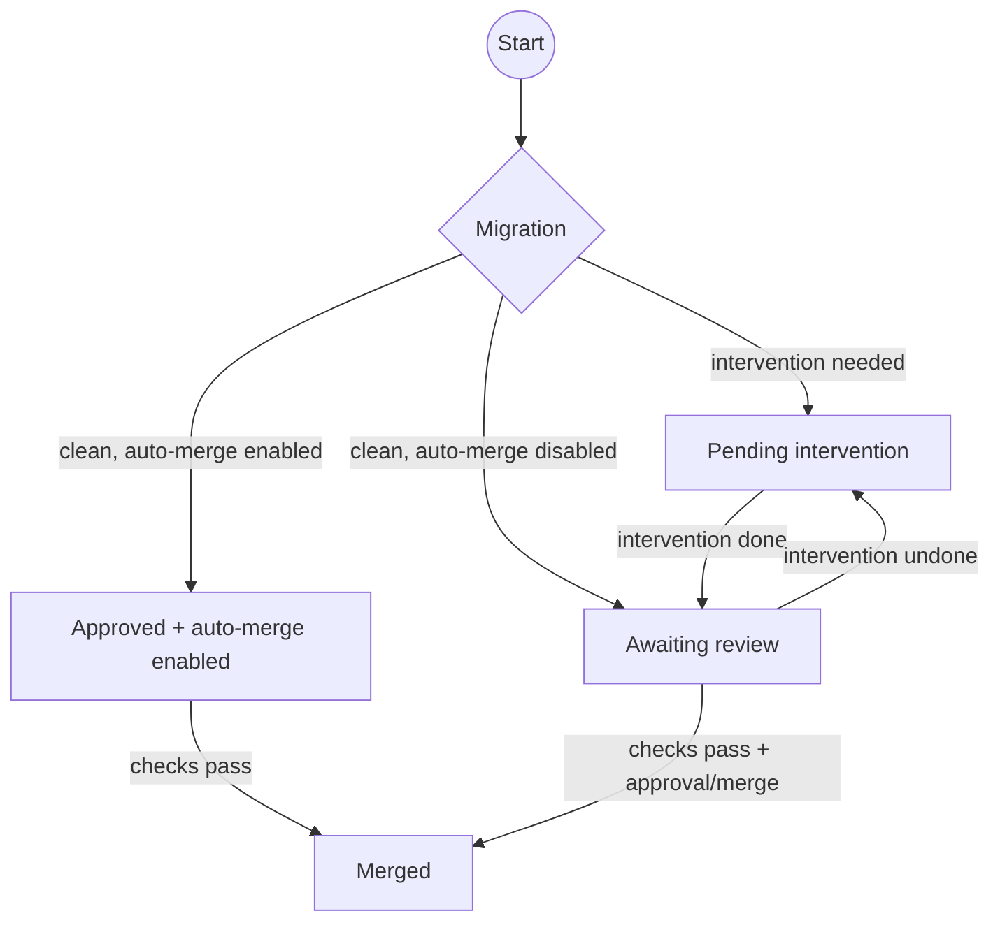

# Dependabot Migrate

A GitHub Action for running migration scripts on Dependabot PRs.

When Dependabot opens a pull request for a dependency group, this
action fetches and runs a migration script for each version in the
upgrade range, commits file changes back to the PR branch, posts a
summary comment, and — optionally — auto-approves and auto-merges
clean migrations.

The migration script can be provided in two ways (mutually exclusive):

* **URL template** (`script-url-template`) — the action downloads a
  separate script for each version from a URL with a `{version}`
  placeholder.
* **Inline script** (`migration-script`) — the script body is embedded
  directly in the workflow YAML and executed once per version, with the
  current version available as the `MIGRATION_VERSION` environment
  variable.

> [!NOTE]
> Migration scripts must be valid Python programs.  See [Writing a
> migration script](#writing-a-migration-script) for the full contract.

## Usage

For most updates, the action handles everything — running the
migration, committing file changes, and (when configured) auto-approving
and merging the PR.  You only need to intervene when the migration
script reports manual intervention is needed.

### How it works

1. Dependabot opens a PR for your dependency group.
2. A workflow in your repository triggers the action.
3. The action fetches Dependabot metadata (old/new versions).
4. For each version in the upgrade range, the migration script is
   downloaded from the URL template (or the inline script is used) and
   executed.
5. File changes are committed to the PR branch.
6. A PR comment and job summary are posted with the results.
7. If all migrations succeed (exit code 0) **and** auto-merge is enabled
   for this case, the PR is auto-approved and auto-merged.
8. If any migration needs intervention (non-zero exit), the job fails and
   the `intervention-pending` label is added.
9. After you complete manual steps, set the `intervention-done`
   label or remove the pending label to trigger the workflow again, which
   normalises the labels and makes the job succeed again.

### Flow



### When manual intervention is needed

If the migration script exits with a non-zero status, the action:

* Posts a PR comment with the full migration output.
* Adds the `intervention-pending` label (configurable via
  `intervention-pending-label`).
* Fails the job, which should block merging.

After completing the required manual steps, push your changes to
the PR branch and signal resolution in **either** of these two ways:

* **Remove** the `intervention-pending` label from the PR.
* **Add** the `intervention-done` label to the PR.

Either action triggers the workflow again, which normalises the labels.
You should still review, approve and merge the PR yourself, as the
action does not auto-approve or enable auto-merge for PRs that required
manual changes.

If intervention is marked as done and you later need more manual work,
either removing `intervention-done` or adding `intervention-pending`
marks intervention as pending again.  In that case, the action removes
`intervention-done`, posts a PR comment, and fails the run intentionally
until intervention is marked done again.

### Re-triggering migration

The action uses `migrated-label` to avoid re-running migration on every
trigger for the same PR.  If you need to run migration again on the
current PR:

1. Remove the `migrated-label` (default `migrated`).
2. Trigger a Dependabot update event via `@dependabot recreate`.

> [!CAUTION]
> Using `@dependabot recreate` will ignore all changes made to the PR and
> generate it from scratch. This is usually necessary because if the migration
> script already ran and made changes, the PR branch will have diverged from
> Dependabot's original commit. This is usually the only way to get an update
> event from dependabot, and the migration script only runs automatically on
> Dependabot events.

### Writing a migration script

The action fetches and runs one migration script per version in the
upgrade range.  Scripts must follow these conventions:

* **Language** — scripts must be valid Python programs.  The Python
  version is configurable via `python-version`.

* **Version** — the current version being migrated is available as
  the `MIGRATION_VERSION` environment variable (e.g. `v0.15.0`).
  This is always set, regardless of whether the script was provided
  via URL template or inline.

* **Exit code** — return **0** if the migration succeeded.  Return a
  **non-zero** exit code if manual intervention is needed.  A non-zero
  exit causes the action to add the `intervention-pending` label, fail
  the job, and block merging until a human resolves the issue.

* **Output** — the script's combined stdout and stderr are captured and
  included verbatim in the commit message, PR comment, and job summary.
  Keep the output **concise and user-oriented** (e.g. a brief summary
  of what was migrated or what needs attention).  Avoid verbose debug
  logging; direct diagnostics to a file or external system instead.

* **GitHub API access** — if the workflow provides a `migration-token`
  input, it is exported to the script as **`GITHUB_TOKEN`** and
  **`GH_TOKEN`** environment variables.  When `migration-token` is
  omitted, both variables are explicitly unset.  See
  [`migration-token`](#migration-token) for details.

## Setup

Create a workflow in your repository (e.g.
`.github/workflows/my-migration.yaml`).

The simplest setup runs migrations and pushes changes, but does not
auto-approve or auto-merge — a human reviews every PR:

```yaml
name: My Migration

on:
  pull_request_target:
    types: [opened, synchronize, reopened, labeled, unlabeled]

permissions:
  contents: write
  issues: write
  pull-requests: write

jobs:
  migrate:
    if: contains(github.event.pull_request.title, 'the my-tool group')
    runs-on: ubuntu-24.04
    steps:
      - uses: frequenz-floss/gh-action-dependabot-migrate@<sha>  # <version>
        with:
          script-url-template: >-
            https://raw.githubusercontent.com/my-org/my-repo/{version}/migrate.py
```

Alternatively, embed the migration script directly in the workflow
(useful when the migration logic is simple and self-contained):

```yaml
jobs:
  migrate:
    if: contains(github.event.pull_request.title, 'the my-tool group')
    runs-on: ubuntu-24.04
    steps:
      - uses: frequenz-floss/gh-action-dependabot-migrate@<sha>  # <version>
        with:
          migration-script: |
            import os, subprocess
            version = os.environ["MIGRATION_VERSION"]
            print(f"Migrating to {version}")
            subprocess.run(["sed", "-i", "s/old_value/new_value/g", "config.yaml"], check=True)
```

To enable auto-approve and auto-merge, generate a token in a prior step
and pass it to the action.  The recommended approach is a [GitHub App]
(see [scenario 2](#2-trusted-script-auto-merge-no-workflow-file-changes)
for the full workflow):

```yaml
jobs:
  migrate:
    if: contains(github.event.pull_request.title, 'the my-tool group')
    runs-on: ubuntu-24.04
    steps:
      - name: Generate token
        id: token
        uses: actions/create-github-app-token@29824e69f54612133e76f7eaac726eef6c875baf  # v2.2.1
        with:
          app-id: ${{ secrets.MY_APP_ID }}
          private-key: ${{ secrets.MY_APP_PRIVATE_KEY }}
      - uses: frequenz-floss/gh-action-dependabot-migrate@<sha>  # <version>
        with:
          script-url-template: >-
            https://raw.githubusercontent.com/my-org/my-repo/{version}/migrate.py
          token: ${{ steps.token.outputs.token }}
          auto-merge-on-changes: "true"
```

> [!IMPORTANT]
> Replace `<sha>` and `<version>` with the actual values.  You can find
> the latest version on the [releases
> page](https://github.com/frequenz-floss/gh-action-dependabot-migrate/releases).

> [!CAUTION]
> The workflow using this action uses `pull_request_target` because Dependabot PRs
> are treated as fork PRs: `GITHUB_TOKEN` is read-only and secrets are
> unavailable with a plain `pull_request` trigger.  The action mitigates
> the risk by never executing code from the PR — the migration script is
> either fetched from an upstream tag or embedded in the workflow YAML on
> the base branch.  For details, see [Preventing pwn
> requests](https://securitylab.github.com/research/github-actions-preventing-pwn-requests/).

### Inputs

| Input | Required | Default | Description |
|---|---|---|---|
| `script-url-template` | **one of** | `""` | URL with `{version}` placeholder for the migration script (mutually exclusive with `migration-script`) |
| `migration-script` | **one of** | `""` | Inline Python script body executed per version; receives `MIGRATION_VERSION` env var (mutually exclusive with `script-url-template`) |
| `token` | no | `""` | Token for pushing, PR approval, and auto-merge (see [Authentication](#authentication)) |
| `migration-token` | no | `""` | Token exposed to migration scripts as `GH_TOKEN`/`GITHUB_TOKEN` (see [Authentication](#authentication)) |
| `auto-merge-on-changes` | no | `"false"` | Auto-approve and auto-merge even when the migration produced commits (requires `token`) |
| `sign-commits` | no | `"false"` | When `"true"`, create migration commits via API so commits have verified signatures (when supported, for example when using a GitHub App for `token`) |
| `report-title` | no | `""` | Heading used for PR comments and job summaries; when empty, uses the calling workflow title |
| `iterate-v0-minors` | no | `"true"` | Iterate through intermediate v0.x minor versions |
| `python-version` | no | `"3.14"` | Python version for running the script |
| `expected-actor` | no | `dependabot[bot]` | GitHub actor whose PRs trigger migration and auto-approval (gates metadata fetch, migration decision, and patch-only auto-approve) |
| `migrated-label` | no | `migrated` | Label name for migrated state |
| `migrated-label-color` | no | `#2B8383` | Hex colour (`#RRGGBB`) for `migrated-label` |
| `migrated-label-description` | no | `Migration script has been run` | Label description for `migrated-label` |
| `intervention-pending-label` | no | `intervention-pending` | Label name for pending intervention |
| `intervention-pending-label-color` | no | `#DE36AD` | Hex colour (`#RRGGBB`) for `intervention-pending-label` |
| `intervention-pending-label-description` | no | `Migration requires manual intervention` | Label description for `intervention-pending-label` |
| `intervention-done-label` | no | `intervention-done` | Label name for completed intervention |
| `intervention-done-label-color` | no | `#0E8A16` | Hex colour (`#RRGGBB`) for `intervention-done-label` |
| `intervention-done-label-description` | no | `Manual migration intervention has been completed` | Label description for `intervention-done-label` |
| `auto-merged-label` | no | `auto-merged` | Label name added when auto-merge is enabled |
| `auto-merged-label-color` | no | `#0E8A16` | Hex colour (`#RRGGBB`) for `auto-merged-label` |
| `auto-merged-label-description` | no | `PR was auto-merged by automation` | Label description for `auto-merged-label` |

### Outputs

| Output | Description |
|---|---|
| `migration_ran` | Whether the migration script(s) executed |
| `overall_exit` | Consolidated exit code: `"0"` if all scripts succeeded, `"1"` if any required intervention |
| `needs_migration` | `"true"` for minor/major bumps, `"false"` for patch-only |
| `commit_made` | Whether the migration produced a commit |

### Requirements

For the action to function correctly, the calling repository must have:

* **A runner image that supports Docker**, for example `ubuntu-24.04`
  (`ubuntu-slim` is not supported as it does not include Docker).

* **Auto-merge enabled** in the repository settings (Settings > General >
  Pull Requests > Allow auto-merge) — only needed when using `token` for
  auto-merge.

* **A Dependabot dependency group** in `.github/dependabot.yml` that
  groups the packages whose updates should trigger migration.  The
  group name must appear in Dependabot's PR titles (e.g. `the my-tool
  group`) so your workflow's `if` condition can match it.

* **A `github-actions` ecosystem** in `.github/dependabot.yml` so the
  workflow's reference to this action stays up to date:

    ```yaml
    - package-ecosystem: "github-actions"
      directory: "/"
      schedule:
        interval: "monthly"
    ```

### Authentication

This action uses up to three tokens, each with a distinct role:

* **`GITHUB_TOKEN`** — automatic; housekeeping (labels, comments,
  checkout) and fallback push.
* **`token`** — optional; push (or GraphQL commit), approve,
  auto-merge.
* **`migration-token`** — optional; GitHub API access for migration
  scripts.

The `sign-commits` input controls how migration commits are created:

* `"false"` (default) — local `git commit` + `git push`.
* `"true"` — via GitHub GraphQL API calls using `token`.

The workflow is responsible for generating the `token` and
`migration-token` values (e.g. via
[`actions/create-github-app-token`](https://github.com/actions/create-github-app-token)
in a prior step, or from a PAT stored as a secret).  The action itself
does not manage GitHub App credentials.

Checkout runs with `persist-credentials: false`.  Push credentials are
configured only in the push step and are never visible to the migration
script environment.

See the subsections below for full details on each token.

#### `GITHUB_TOKEN`

The automatic `GITHUB_TOKEN` provided by GitHub Actions.  No
configuration is needed — the workflow only needs to declare the
required `permissions` scopes.

**Required permissions:**
* `contents: write` — checkout and fallback push when `token` is not set.
* `issues: write` — create and manage labels.
* `pull-requests: write` — read PR metadata and post PR comments.

**Used for:** reading labels, posting PR comments, managing labels,
and pushing migration commits when `token` is not set.

**Limitations:**
* API calls made with `GITHUB_TOKEN` **do not trigger follow-up
  workflows** (merge queue CI, status checks, etc.).  This is why a
  separate `token` is needed for approval and merging.
* `GITHUB_TOKEN` **cannot push workflow file changes**
  (`.github/workflows/*`) — there is no `workflows` permission
  available for `GITHUB_TOKEN`.  This is a safety rail; to push
  workflow file changes, provide a `token` with Workflows write
  permission (see below).

#### `token`

An optional input for operations that need to trigger follow-up
workflows or require elevated permissions.

**Used for:**
* Pushing migration commits (overrides the `GITHUB_TOKEN` fallback)
  when `sign-commits` is `"false"`.
* Creating migration commits via GraphQL `createCommitOnBranch`
  when `sign-commits` is `"true"`.
* Approving PRs and enabling auto-merge.

When `token` is omitted, migration commits are pushed with
`GITHUB_TOKEN` and there is no auto-approve or auto-merge.

##### Required permissions

At minimum, `token` needs:

* `Contents: write` — to push migration commits to the PR branch.
* `Pull requests: write` — to approve PRs and enable auto-merge.

Additionally, `token` must trigger follow-up workflows (merge queue
CI, etc.) — `GITHUB_TOKEN` cannot do this, so a GitHub App token or
PAT is required.

##### Push and workflow files

GitHub requires a special "Workflows" permission to push changes to
files under `.github/workflows/`.  This is the **only known path-based
push restriction** — all other files only need `Contents: write`.

The permission requirements differ by token type:

| Token type | Permission needed for workflow files |
|---|---|
| `GITHUB_TOKEN` | **Cannot** push workflow files (no `workflows` permission available) |
| GitHub App | "Workflows" repository permission |
| Fine-grained PAT | "Workflows" permission |
| Classic PAT | `workflow` scope |

If the migration modified `.github/workflows/*` files and `token` is
not set, **the push will fail** because `GITHUB_TOKEN` cannot push
workflow files.  To push workflow file changes, explicitly provide a
`token` with workflow-write permission.

##### GitHub App (recommended)

A [GitHub App] installation token is the recommended approach.  The app
needs `Contents: write` and `Pull requests: write` permissions.  Add
`Workflows: write` if migration changes can touch workflow files.

Generate the token in a prior step with
[`actions/create-github-app-token`](https://github.com/actions/create-github-app-token)
and pass it to the action:

```yaml
steps:
  - name: Generate token
    id: token
    uses: actions/create-github-app-token@29824e69f54612133e76f7eaac726eef6c875baf  # v2.2.1
    with:
      app-id: ${{ secrets.MY_APP_ID }}
      private-key: ${{ secrets.MY_APP_PRIVATE_KEY }}
  - uses: frequenz-floss/gh-action-dependabot-migrate@<sha>  # <version>
    with:
      token: ${{ steps.token.outputs.token }}
```

##### Personal Access Token (PAT)

A [fine-grained personal access token][PAT] with `Contents: write` and
`Pull requests: write` also works.  Add `Workflows: write` if needed.
Store it as a repository or organisation secret and pass it directly:

```yaml
steps:
  - uses: frequenz-floss/gh-action-dependabot-migrate@<sha>  # <version>
    with:
      token: ${{ secrets.MY_PAT }}
```

Note that PATs are tied to a personal account and approvals/merges will
appear as that user.  A GitHub App is preferred for organisational use.

For classic PATs, the `repo` scope covers contents and pull requests,
and the `workflow` scope covers workflow file pushes.

##### Verified commit signatures

If your repository requires signed commits, set `sign-commits: "true"`.
The action will create migration commits via
[`planetscale/ghcommit-action`](https://github.com/planetscale/ghcommit-action),
which calls GitHub's GraphQL `createCommitOnBranch` mutation instead of
local `git commit`.

With GitHub App installation tokens (recommended), these commits are
signed by GitHub and shown as **Verified** in the UI.  This is the most
reliable setup for bot-driven migrations under branch protection rules.

PATs can still be used with `sign-commits: "true"`, but GitHub may not
mark those commits as **Verified**.  For strict PAT-only
verified-signing requirements, additional key-based signing support is
needed.

#### `migration-token`

An optional input exposed to migration scripts as `GH_TOKEN` and
`GITHUB_TOKEN` environment variables.  It is **only** injected during
the migration script execution step — never used for push, approve, or
merge operations.

When omitted, the migration script runs with **no GitHub credentials at
all** (the environment variables are explicitly unset).

##### When to use

Only set `migration-token` when migration scripts need to call
authenticated GitHub APIs (for example, to update repository settings,
branch protection rules, or other configuration).

##### Permissions

Use a dedicated, least-privilege token scoped to exactly what the
script needs.  If the migration script does not need any extra
permissions beyond what `token` already has, you can share the same
token for both (see [scenario 5](#5-script-needs-api-access-may-touch-workflow-files)).

### Trust model and scenarios

The action offers three knobs for controlling trust:

1. **`token`** — whether the action can auto-approve and auto-merge, and
   what permissions the push step has.
2. **`auto-merge-on-changes`** — whether to auto-merge when the migration
   produced file changes (commits).
3. **`migration-token`** — whether the migration script gets GitHub API
   access.

The table below summarises how these combine.  In all scenarios,
`GITHUB_TOKEN` handles labels, comments, and metadata automatically.

| Scenario | `token` | `auto-merge-on-changes` | `migration-token` | Behaviour |
|---|---|---|---|---|
| 1. Untrusted script | — | `"false"` | — | Migration runs and pushes via `GITHUB_TOKEN`. No auto-merge. Human reviews everything. |
| 2. Trusted script, auto-merge, no workflow files | set (Contents + PRs) | `"true"` | — | Migration runs, pushes via `token`, auto-approves and auto-merges. |
| 3. Trusted script, auto-merge, may touch workflow files | set (Contents + PRs + Workflows) | `"true"` | — | Same as 2, but `token` has workflow-write permission so pushes to `.github/workflows/*` succeed. |
| 4. Script needs API access, no workflow files | set (Contents + PRs) | `"true"` | set (script-specific) | Migration runs with `migration-token` for API calls, pushes via `token`, auto-merges. |
| 5. Script needs API access, may touch workflow files | set (Contents + PRs + Workflows) | `"true"` | set (script-specific) | Same as 4, but `token` has workflow-write permission. |
| 6. Full automation but human review on changes | set (Contents + PRs + Workflows) | `"false"` | set (script-specific) | Migration runs with full API access, pushes via `token`, but auto-merge only for patch updates or no-file-change migrations. Human reviews commits. |

#### Scenario details

##### 1. Untrusted migration script — no extra tokens

The most conservative setup.  No `token` is provided, so migration
commits are pushed with `GITHUB_TOKEN` and there is no auto-approve or
auto-merge.  A human must review and merge every PR.

If the migration script modifies `.github/workflows/*` files, the push
will fail because `GITHUB_TOKEN` cannot push workflow file changes.
This is intentional — it prevents untrusted scripts from injecting
workflow code.

```yaml
permissions:
  contents: write
  issues: write
  pull-requests: write

jobs:
  migrate:
    if: contains(github.event.pull_request.title, 'the my-tool group')
    runs-on: ubuntu-24.04
    steps:
      - uses: frequenz-floss/gh-action-dependabot-migrate@<sha>  # <version>
        with:
          script-url-template: >-
            https://raw.githubusercontent.com/my-org/my-repo/{version}/migrate.py
```

##### 2. Trusted script, auto-merge, no workflow file changes

The migration script is trusted and does not modify workflow files.
Provide a `token` with `Contents: write` and `Pull requests: write`.
Set `auto-merge-on-changes: "true"` to auto-merge even when the
migration produces file changes.

```yaml
permissions:
  contents: write
  issues: write
  pull-requests: write

jobs:
  migrate:
    if: contains(github.event.pull_request.title, 'the my-tool group')
    runs-on: ubuntu-24.04
    steps:
      - name: Generate token
        id: token
        uses: actions/create-github-app-token@29824e69f54612133e76f7eaac726eef6c875baf  # v2.2.1
        with:
          app-id: ${{ secrets.MY_APP_ID }}
          private-key: ${{ secrets.MY_APP_PRIVATE_KEY }}
      - uses: frequenz-floss/gh-action-dependabot-migrate@<sha>  # <version>
        with:
          script-url-template: >-
            https://raw.githubusercontent.com/my-org/my-repo/{version}/migrate.py
          token: ${{ steps.token.outputs.token }}
          auto-merge-on-changes: "true"
```

##### 3. Trusted script, auto-merge, may touch workflow files

Same as scenario 2, but the migration script may modify
`.github/workflows/*` files.  The GitHub App (or PAT) must additionally
have "Workflows" permission.

The workflow is identical to scenario 2 — the only difference is
the GitHub App's configured permissions.

> [!WARNING]
> Granting workflow-write permission means the migration script can
> introduce workflow file changes that, after auto-merge, run with access
> to repository secrets.  Only use this when you fully trust the migration
> script source.

##### 4. Script needs API access, no workflow file changes

The migration script needs to call GitHub APIs (e.g. to update
repository settings or branch rulesets) but does not modify workflow
files.  Generate a separate `migration-token` scoped to only the
permissions the script needs.

```yaml
permissions:
  contents: write
  issues: write
  pull-requests: write

jobs:
  migrate:
    if: contains(github.event.pull_request.title, 'the my-tool group')
    runs-on: ubuntu-24.04
    steps:
      - name: Generate token
        id: token
        uses: actions/create-github-app-token@29824e69f54612133e76f7eaac726eef6c875baf  # v2.2.1
        with:
          app-id: ${{ secrets.MY_APP_ID }}
          private-key: ${{ secrets.MY_APP_PRIVATE_KEY }}
      - name: Generate migration token
        id: migration-token
        uses: actions/create-github-app-token@29824e69f54612133e76f7eaac726eef6c875baf  # v2.2.1
        with:
          app-id: ${{ secrets.MIGRATION_APP_ID }}
          private-key: ${{ secrets.MIGRATION_APP_PRIVATE_KEY }}
      - uses: frequenz-floss/gh-action-dependabot-migrate@<sha>  # <version>
        with:
          script-url-template: >-
            https://raw.githubusercontent.com/my-org/my-repo/{version}/migrate.py
          token: ${{ steps.token.outputs.token }}
          migration-token: ${{ steps.migration-token.outputs.token }}
          auto-merge-on-changes: "true"
```

##### 5. Script needs API access, may touch workflow files

Same as scenario 4, but the migration may also modify workflow files.
Give the token's GitHub App workflow-write permission.  If the
migration script does not need any extra permissions beyond what `token`
already has, you can **share the same token** for both:

```yaml
    steps:
      - name: Generate token
        id: token
        uses: actions/create-github-app-token@29824e69f54612133e76f7eaac726eef6c875baf  # v2.2.1
        with:
          app-id: ${{ secrets.MY_APP_ID }}
          private-key: ${{ secrets.MY_APP_PRIVATE_KEY }}
      - uses: frequenz-floss/gh-action-dependabot-migrate@<sha>  # <version>
        with:
          script-url-template: >-
            https://raw.githubusercontent.com/my-org/my-repo/{version}/migrate.py
          token: ${{ steps.token.outputs.token }}
          migration-token: ${{ steps.token.outputs.token }}
          auto-merge-on-changes: "true"
```

> [!WARNING]
> Sharing `token` as `migration-token` gives the migration script the
> same permissions used for push and approve/merge.  This is reasonable
> when you fully trust the script, but reduces isolation.

##### 6. Full automation but human review on changes

The migration script has full API access and `token` has workflow-write
permission, but you still want a human to review any file changes before
merging.  Leave `auto-merge-on-changes` at its default (`"false"`).

Patch-only updates (no migration needed) and migrations that exit
cleanly without modifying any files are still auto-merged.  Only PRs
where the migration actually committed file changes require human
review.

```yaml
permissions:
  contents: write
  issues: write
  pull-requests: write

jobs:
  migrate:
    if: contains(github.event.pull_request.title, 'the my-tool group')
    runs-on: ubuntu-24.04
    steps:
      - name: Generate token
        id: token
        uses: actions/create-github-app-token@29824e69f54612133e76f7eaac726eef6c875baf  # v2.2.1
        with:
          app-id: ${{ secrets.MY_APP_ID }}
          private-key: ${{ secrets.MY_APP_PRIVATE_KEY }}
      - uses: frequenz-floss/gh-action-dependabot-migrate@<sha>  # <version>
        with:
          script-url-template: >-
            https://raw.githubusercontent.com/my-org/my-repo/{version}/migrate.py
          token: ${{ steps.token.outputs.token }}
          migration-token: ${{ steps.token.outputs.token }}
          # auto-merge-on-changes defaults to "false"
```

### Permissions

The workflow using this action needs these permission scopes:

* `contents: write` — to commit migration changes and push to the PR
  branch.
* `issues: write` — to create and manage labels.
* `pull-requests: write` — to post comments, approve PRs, and enable
  auto-merge.

If migration changes can touch `.github/workflows/*`, provide a `token`
with workflow-write permission (see [`token` — Push and workflow
files](#push-and-workflow-files)).

### Labels

The action manages these labels:

- **`migrated-label`** (default `migrated`) — migration
  script has been run
- **`intervention-pending-label`** (default
  `intervention-pending`) — migration needs manual
  intervention
- **`intervention-done-label`** (default
  `intervention-done`) — manual intervention
  completed
- **`auto-merged-label`** (default `auto-merged`) — action enabled
  auto-merge

Label colours are configurable via `migrated-label-color`,
`intervention-pending-label-color`, `intervention-done-label-color`, and
`auto-merged-label-color` and use `#RRGGBB` format.
Label descriptions are configurable via
`migrated-label-description`, `intervention-pending-label-description`,
`intervention-done-label-description`, and
`auto-merged-label-description`.

## External actions

This action depends on the following external actions:

* [`dependabot/fetch-metadata`](https://github.com/dependabot/fetch-metadata):
  Fetch Dependabot PR metadata (versions, update type, grouped dependencies)
* [`actions/checkout`](https://github.com/actions/checkout): Check out the PR
  branch so migration scripts can modify files
* [`actions/setup-python`](https://github.com/actions/setup-python): Provide
  the Python interpreter for migration scripts
* [`frequenz-floss/gh-action-setup-git`](https://github.com/frequenz-floss/gh-action-setup-git):
  Configure Git identity for local commits
* [`planetscale/ghcommit-action`](https://github.com/planetscale/ghcommit-action):
  Create verified commits via GraphQL when `sign-commits: "true"`

## Development

For contributor-focused development setup, linting, test workflow, and
submodule update guidance, see [DEVELOPMENT.md](DEVELOPMENT.md).

## License

[MIT](LICENSE) © [Frequenz Energy-as-a-Service GmbH](https://frequenz.com)

[GitHub App]: https://docs.github.com/en/apps/creating-github-apps
[PAT]: https://docs.github.com/en/authentication/keeping-your-account-and-data-secure/managing-your-personal-access-tokens#fine-grained-personal-access-tokens
